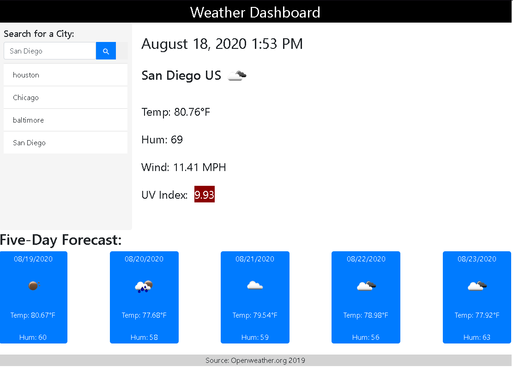

# Weather Dashboard

## FUNCTIONALITY

 AJAX to hook into the API to retrieve data in JSON format and display the following under current weather conditions:

* City

* Date

* Icon image (visual representation of weather conditions)

* Temperature

* Humidity

* Wind speed

* UV index

Also, a 5-Day Forecast displays below the current weather conditions that displays the following:

* Date

* Icon image (visual representation of weather conditions)

* Temperature

* Humidity

## USAGE
    npm start

## BUILT WITH

* Bootstrap
* jQuery
* ments.js
* Ajax
* JSON data
